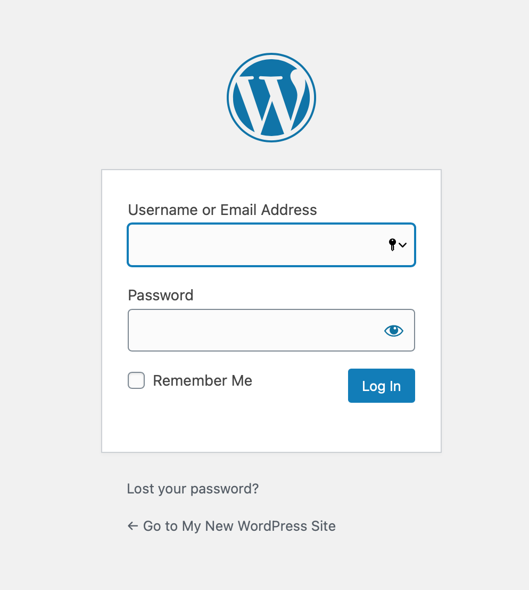
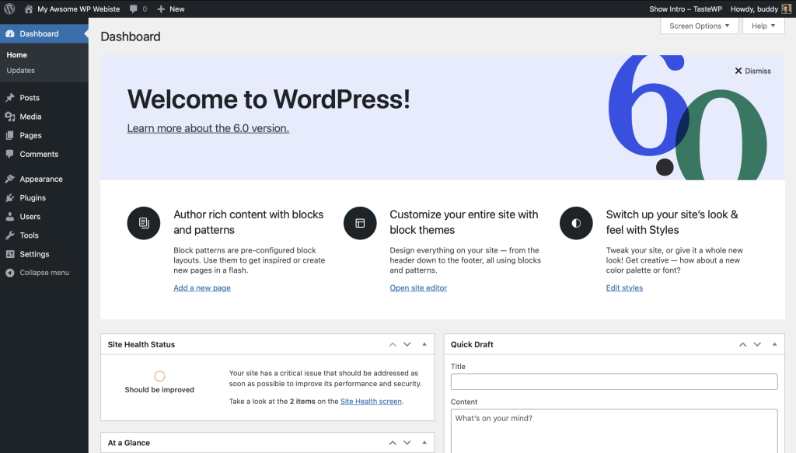
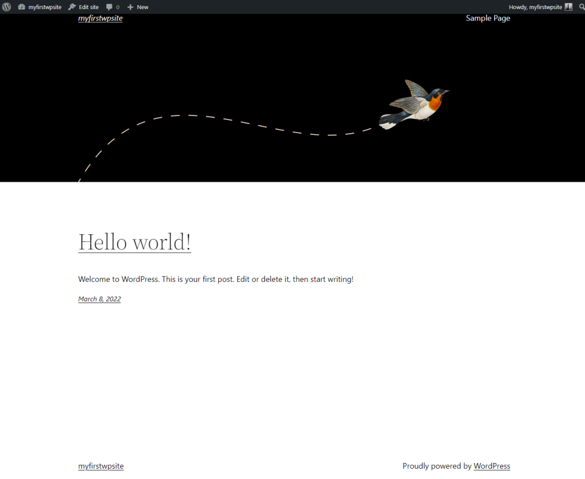
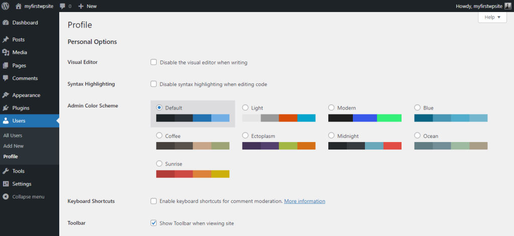
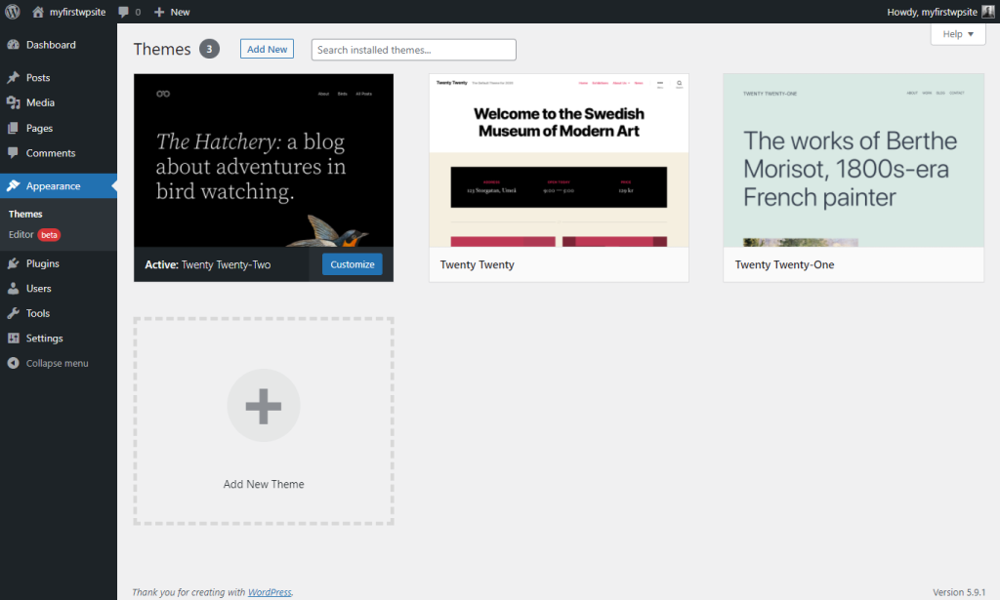
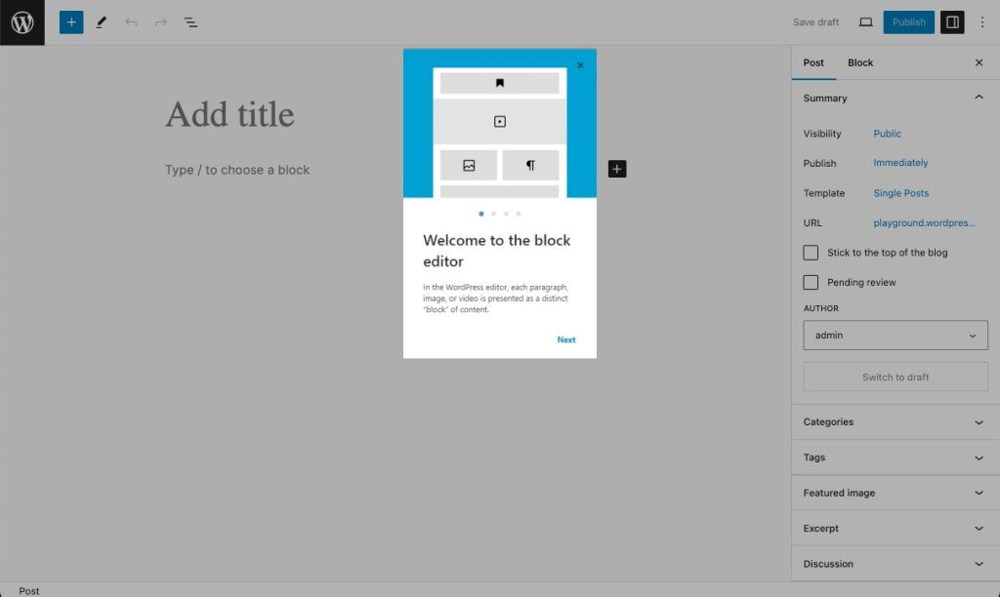
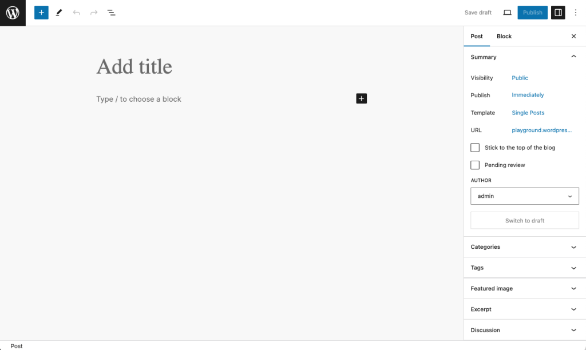
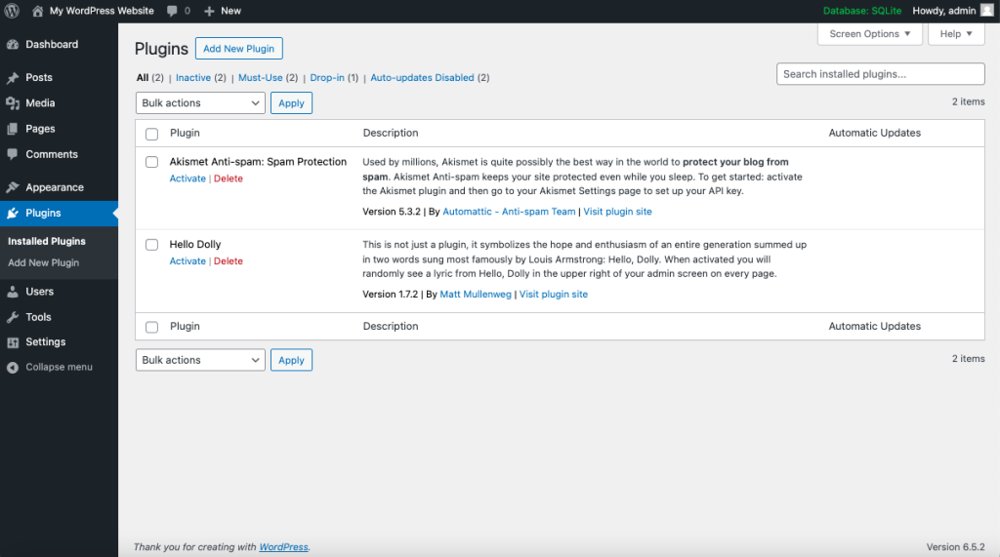

## 🚀 WordPress ile ilk adımlar (Block Editor)

### 📑 Bu makalede

İçindekiler

Bu sayfa, WordPress’in Blok Düzenleyicisi (Block Editor) kullanılarak anlatılmaktadır. Eğer daha eski bir WordPress sürümü veya Klasik Düzenleyici (Classic Editor) eklentisi kullanıyorsanız, lütfen bu sayfaya bakınız.

---

### ⏱️ 5 dakikalık kurulumu yaptım. Şimdi ne olacak?

WordPress’in 5 Dakikalık Kurulumunu (5-Minute Installation) veya barındırma sağlayıcınız üzerinden tek tıkla kurulumu tamamladınız. Peki, sonraki adımınız nedir?

Haydi adım adım WordPress sitenizi inceleyelim, farklı işlevlerin nasıl çalıştığını görelim ve yeni sitenizi nasıl kendinize ait hale getirebileceğinizi keşfedelim. Bu eğitimin ilk bölümünde, eğitimde anlatılanlar dışında program içinde herhangi bir değişiklik yapmayın. Bu adımları takip ettikten sonra, her şeyi rahatça değiştirebileceksiniz.

---

### 🔑 Giriş yap (Log In)

Öncelikle web sitenizin yönetim alanına (administration area) veya arka ucuna (back end) giriş yapın. Bunun için alan adınızın sonuna `wp-admin` ekleyerek giriş sayfanızı ziyaret edin (örneğin: `http://example.com/wp-admin`). Bazı temalar, ön yüzde (front end) bir giriş bağlantısı veya formu da sağlayabilir.

Şimdi, 5 dakikalık kurulum (5-minute install) sırasında oluşturduğunuz kullanıcı adı ve şifreyle WordPress’e giriş yapın.

---

## ⬆️ En üstten başlayın (Start at the top)

## 📊 Ana yönetim ekranı: Gösterge Paneli (Dashboard)

Giriş yaptıktan sonra, ana yönetim ekranı olan **Gösterge Paneli (Dashboard)** karşınıza gelir. Burası, sitenizin organizasyonunun başladığı yerdir.

Ekranın üst kısmında **araç çubuğu (toolbar)** bulunur. Buradan sitenizin adına tıklayın; bu bir bağlantıdır ve sizi yeni WordPress sitenizin görünümüne götürür. Beğendiniz mi? Beğenmediniz mi? Hiç fark etmez, sadece bakın. Çünkü burada çok zaman geçireceksiniz!

---

## 🚗 WordPress sitenizi test edin (Test drive your WordPress site)

Değişiklik yapmaya başlamadan önce sitenizi incelemeye zaman ayırın ve her şeyin nasıl çalıştığını anlamaya çalışın. **WordPress Twenty Twenty-Two** temasının nasıl düzenlendiğini ve nasıl çalıştığını görmek önemlidir. Bunu, özel özellikler eklemeye başlamadan önce bir **test sürüşü** (test drive) olarak düşünün.

## 🎨 WordPress Tema Düzeni (Theme Layout)

Gördüğünüz düzen, bir **WordPress Teması (WordPress Theme)** tarafından tanımlanır. Bu, web sitenizin görünümünü, sitenin stilini ve içeriğin çerçevesini belirler. **WordPress Twenty Twenty-Two** teması, üst kısımda sitenizin başlığı ve sloganının yer aldığı bir **üstbilgi (header)** içerir. Bunun altında, varsa, **Menü (Menu)** bulunur. Sayfanın orta kısmındaki ana bölüm ise **içerik alanıdır (content area)**.

Sayfayı aşağı kaydırdığınızda bir **arama kutusu (search box)**, **son yazılar (recent posts)** ve **son yorumlar (recent comments)** görürsünüz. Bunlara **Bileşenler (Widgets)** denir.

Sayfanın sonunda bir çubuk fark edeceksiniz. Bu kısım **altbilgi (footer)** olarak adlandırılır. Burada “Proudly powered by WordPress.” yazısı bulunur.

---

## 🌍 Kısa bir tur atın (Take a Quick Trip Around)

Şu anda yalnızca bir yazınız var. Bu yazı, ana sayfanız veya ön sayfa (front page) olarak düzenlenmiş bir sayfanın içinde bulunur. Yazının başlığına tıkladığınızda, sizi doğrudan o yazıya özel sayfaya götürür.

Sitenizin ilk sayfası veya ana sayfası (home page), en yeni yazılarınızı içerir. Her yazı başlığı, ilgili yazının sayfasına bağlantı verir. Bazı Tema tasarımcıları, tekil yazı (single post) sayfalarını ana sayfadan farklı görünecek şekilde tasarlar.

Tekil yazılarda düzenlemeye dikkat edin ve tasarım öğelerindeki farklılıkları gözlemleyin. Üstbilgi (header) farklı mı? Daha küçük, daha büyük veya farklı bir renkte mi? Yan menü (sidebar) var mı?

Bütün bu değişiklikler, **şablon dosyaları (template files)** denilen birkaç dosya sayesinde yapılır. Bunların nasıl çalıştığını **Tema Geliştirici El Kitabı (Theme Developer Handbook)** içinde öğrenebilirsiniz. Şimdilik, WordPress’in geri kalanının nasıl çalıştığına geçelim.

---

## ⚙️ WordPress Yönetim Ekranlarını Deneyin (Test Drive the WordPress Administration Screens)

Artık sitenizin nasıl göründüğü ve farklı düzen bölümlerinin ne olarak adlandırıldığını öğrendiğinize göre, **WordPress Yönetim Paneli (Administration)** üzerinde test sürüşü yapmanın zamanı geldi. Bu, yeni web sitenizin arka ucunu (backend) tanımak gibidir.

Aslında, giriş yaptıktan sonra gördüğünüz ilk sayfa **Gösterge Paneli (Dashboard)** sayfasıdır. Bu sayfa, WordPress sitenizdeki aktiviteler ve işlemler hakkında bilgi ve verilerin toplandığı bir ekrandır.

## 📋 Gösterge Paneli Özellikleri (Dashboard Features)

**Gösterge Paneli (Dashboard)**, sitenizde gerçekleştirdiğiniz en son etkinliklerin bir listesini içerir ve birçok WordPress kaynağından gelen yeni ve ilginç bilgileri takip etmenize yardımcı olur.

Ekranın sol tarafında, gerçekleştirebileceğiniz tüm yönetim işlevlerini ayrıntılı şekilde gösteren **ana gezinme menüsü (main navigation menu)** bulunur. Fareyi liste boyunca aşağıya doğru hareket ettirdiğinizde **alt menüler (sub-menus)** açılır ve tıklayarak seçim yapabilirsiniz. Bir **üst menü (parent navigation section)** seçtiğinizde, o bölümdeki seçenekler açılarak görünür hale gelir.

---

## 📂 Menü Öğeleri (Menu Items)

Menüde yer alan öğeler şunlardır:

* Dashboard
* Posts
* Media
* Pages
* Comments
* Appearance
* Plugins
* Users
* Tools
* Settings

---

## 👤 Kullanıcı ekranı ile başlayalım (Let’s start with the User screen)

**Users** sekmesine tıklayın. Ekran değişecek ve size **Tüm Kullanıcılar (All Users)** ekranı gösterilecektir. Burada tüm kullanıcıların listesini görebilir, yeni kullanıcı ekleyebilir veya mevcut kullanıcı ve yazar hesaplarını değiştirebilirsiniz.

Gezinme menüsünden **Your Profile** seçeneğine tıklayın. Burada kendinizle ilgili bilgileri gireceksiniz: sitenin yazarı ve yöneticisi (administrator) olarak bilgilerinizi doldurun. İşiniz bittiğinde **Update Profile** düğmesine tıklayın.

## 🛠️ WordPress Yönetimindeki Diğer Güçlü Özellikler (Other Powerful Features of the WordPress Admin)

---

## 🎨 Görünümü Değiştirme (Changing the Look)

## 🎨 Görünümü Değiştirme (Changing the Look)

**Görünüm > Temalar (Appearance, Themes Screen)** ekranı, sitenizin görünümünü farklı **Temalar (Themes)** kullanarak değiştirmenize olanak tanır. Temalar, sitenizin görünümünü tamamen değiştiren sunum stilleridir. Geliştiriciler ve kullanıcılar tarafından tasarlanan yüzlerce tema arasından seçim yapabilirsiniz.

**Görünüm (Appearance)** ekranında, şu anda yüklü olan temaların bir listesini göreceksiniz; bu listeye **WordPress Twenty Twenty-Two** teması da dahildir.

Temayı hızlıca değiştirmek için, listelenen temalardan birinin altındaki **Etkinleştir (Activate)** düğmesine tıklayın. Ardından, üst araç çubuğunda (toolbar) sitenizin adına tıklayarak yeni görünümü inceleyin. İşte bu kadar kolay, siteniz artık farklı görünüyor.

Varsayılan tasarıma geri dönmek için **Görünüm > Temalar (Appearance > Theme)** yolunu izleyin ve **WordPress Twenty Twenty-Two** temasının altındaki **Etkinleştir (Activate)** düğmesine tıklayın. Yeniden görmek için üst araç çubuğunda sitenizin adına tıklayın, işte karşınızda!

## ✍️ Yazı oluşturma (Creating a post)

Yönetim Ekranına (Administration Screen) geri dönün ve **Yazılar (Posts) Ekranına** göz atın. **Yazılar Menüsü (Posts Menu)** altındaki sekmeleri kullanarak yazılarınızı yazabilir ve yönetebilirsiniz. İlk test yazınızı oluşturmak için **Yeni Ekle (Add New)** sekmesiyle başlayalım.

**Blok Düzenleyiciyi (Block Editor)** ilk kez kullandığınızda kısa bir eğitim (tutorial) göreceksiniz.

## ✍️ Yazı ekleme (Creating a post)

Makale başlığını ayrılmış alana yazın. Ardından “Start writing or type / to choose a block” bölümüne metninizi girin. Bu sadece bir deneme yazısı olduğu için istediğiniz herhangi bir şeyi yazabilirsiniz. İşiniz bittiğinde, sayfanın sağ üst köşesindeki **Yayımla (Publish)** düğmesine tıklayın, ardından onaylamak için ikinci kez tıklayın. Artık yazı yazma sürecine aşina oldunuz. Yazılarınızı görmek için ekranın üst kısmındaki araç çubuğunda sitenizin adına tıklayın.

---

## 💬 Yorumlar (Comments)

WordPress’in eğlenceli yanlarından biri, ziyaretçilerin sitenize yorum bırakabilmesidir. Bu, sizinle okuyucular arasında dinamik bir etkileşim yaratır. Yazılarınızda yorum olsun ister misiniz?

Yorumlar çok çeşitli şekillerde olabilir: küçük bir teşekkür (Harika iş! Yazıyı beğendim!) mesajından uzun sohbetlere ve tartışmalara kadar. Hatta gönderdiğiniz bilgilere katkıda bulunan yorumlar bile olabilir. Ancak yorumlara yanıt vermek ve onları yönetmek zaman alabilir. Eğer yorumlar siteniz için önemliyse, onları etkinleştirin ve nasıl görüneceklerini düşünün.

Kendi yazınıza birkaç yorum ekleyebilirsiniz. Onların düzenini inceleyin ve sitenizin tasarımına nasıl uyacaklarını değerlendirin. Yorumlarla nasıl ilgileneceğinize karar verdiğinizde, WordPress yorumlar ve tartışma ayarlarıyla ilgili makaleyi okuyarak bu özellikleri ayarlayabilirsiniz.

---

## 🛡️ Spam’i önleme (Preventing Spam)

Sitenizde yorumlara izin verdiğinizde düşünmeniz gereken başka bir konu da spam’dir. Ne yazık ki spam, hayatın bir gerçeğidir. Yorum spamleriyle mücadeleye başlamak için **Introduction to Dealing with Comment Spam** makalesini incelemeniz önerilir.

---

## 🗂️ Kategoriler oluşturma (Create Categories)

Yazılar genellikle **Kategoriler (Categories)** ve/veya **Etiketler (Tags)** içinde saklanır. Böylece ilgili konuları bir arada tutabilirsiniz. Şu anda yalnızca bir kategoriniz var, ancak yakında daha fazlasına ihtiyaç duyacaksınız.

**Yazılar > Kategoriler (Posts > Categories)** sekmesinde, **Yeni Kategori Ekle (Add New Category)** alanında kategorinizle ilgili bilgileri doldurun. Önce ana kategorilerinizi eklemeye devam edin. Tüm ana kategoriler eklendikten sonra alt kategorileri (subcategories) ekleyin.

Not: Yeni kategori istediğiniz zaman eklenebilir. Ancak kategoriler WordPress’te iki şekilde sıralanabilir: isimlerine göre (alfabetik) veya ID numarasına göre. Kategorileri eklediğinizde onlara bir ID numarası atanır. Bunu değiştirmek zordur, bu nedenle kategorilerinizin alfabetik olarak değil de belirli bir sırayla görünmesini istiyorsanız, onları görmek istediğiniz sırayla ekleyin.

---

## ⚙️ Sitenizi kurma (Setting Up Your Site)

Sitenizin görsel görünümüne geçmeden önce birkaç yönetim ayarı daha yapalım. Web sitenizi güçlendirmek için eklentiler (plugins) kurmak isteyebilirsiniz. Yorum spam’ine karşı koruma sağlamak için tüm WordPress siteleriyle birlikte gelen **Akismet WordPress Eklentisini** (Akismet WordPress Plugin) etkinleştirmeyi unutmayın.

Ana kategorilerinizi girdikten sonra alt kategorilerinizi ekleyin. **Üst Kategori (Parent Category)** açılır menüsünden, eklediğiniz alt kategorinin bağlı olacağı üst kategoriyi seçebilirsiniz. **Yönet > Kategoriler (Manage > Categories)** ekranında kategorilerinizi şu şekilde listelenmiş göreceksiniz:

* Computer Tips
* Windows
* Linux
* Mac
* Internet News
* Web Page Design
* Web Standards
* WordPress
* Plugins
* Themes

---

## 📰 Yazıları kategorilere koyma (Put Posts in Categories)

Deneme yazılarınızdan bazılarını kategorilere ekleyelim. **Yazılar > Kategoriler (Posts > Category)** ekranında, **Tüm Yazılar (All Posts)** sekmesine tıklayın. Burada girdiğiniz deneme yazılarını göreceksiniz.

Her yazının başlığı üzerine geldiğinizde altında şu bağlantılar çıkacaktır: **Düzenle (Edit) | Hızlı Düzenle (Quick Edit) | Çöp (Trash) | Görüntüle (View)**. Düzenlemek için **Düzenle (Edit)** bağlantısına tıklayın.

**Yazıyı Düzenle (Edit Post)** ekranının sağ tarafında **Kategoriler (Categories)** alanını göreceksiniz. Bunlardan birini seçmek için yanındaki kutuyu işaretleyin. Ardından, yukarıdaki **Yayımla (Publish)** bölümünde **Güncelle (Update)** düğmesine tıklayın.

Bunu diğer deneme yazılarınız için de tekrarlayın ve her birini farklı bir kategoriye yerleştirin. Yönetim ekranınızın üst kısmındaki araç çubuğundan sitenizin adına tıklayarak sayfanızı görüntüleyin. Artık kategorilerin yan menüde listelendiğini görüyor musunuz? Harika.

Eksik bir kategori varsa, bu genellikle içinde henüz yazı bulunmadığı anlamına gelir. WordPress’in varsayılan işlevi budur. Eksik kategoriye bir yazı eklediğinizde, o kategori sitenizde görünür hale gelecektir.

Kategorilerden birine tıkladığınızda, sadece o kategoriye ait yazıların yer aldığı sayfaya yönlendirilirsiniz. Bu, WordPress’in otomatik oluşturduğu bir **Kategori Sayfasıdır (Category Page)**.

Şimdi, görüntülenen **Arşivler (Archives)** bağlantısına tıklayın. Burada, o ay içinde yayımlanmış yazılarınızın kronolojik olarak listelendiği bir sayfaya ulaşırsınız – bu durumda yalnızca bugünkü yazınız. Yani aynı bilgilere ulaşmanın iki farklı yöntemi vardır.

---

## ⏭️ Sırada ne var (What Is Next)

Artık yeni WordPress siteniz için temel adımları tamamladınız. Yazı yazmayı, kategori oluşturmayı ve sitenizdeki içerikleri kategori ve arşivlere göre nasıl görüntüleyeceğinizi öğrendiniz.

Artık özelleştirme sürecine başlayabilirsiniz. İşiniz bittiğinde deneme yazılarınızı silmeyi unutmayın. Ardından, yeni kitlenizle paylaşmak için harika içerikler yazmaya başlayın!

---

## 🎨 WordPress Temalarını kullanma (Using WordPress Themes)

Seçebileceğiniz yüzlerce WordPress Teması vardır. Hepsi temelde aynı işlevi görür, ancak bilgileri görsel olarak farklı şekillerde sunar. İlginizi çeken, hedef kitlenizin ihtiyaçlarını karşılayan ve sizin beklentilerinize uygun birkaç tema seçin. Daha sonra yukarıda anlatıldığı gibi test sürüşünü (test drive) yapın.

Tüm siteyi, kategorileri, arşivleri ve tekil yazıları dolaşarak temanın her birini nasıl işlediğini görün. Ön sayfada güzel görünebilir, ancak tekil yazılarda hoşunuza gitmeyen bir düzen sunuyorsa, kodlara girip değişiklik yapmanız gerekir. Buna hazır değilseniz başka bir tema deneyin.

---

## 📂 WordPress Tema Dizini (WordPress Theme Directory)

* Tema kullanma (Using Theme)
* Kendi temanızı oluşturma (Creating your own Theme)

Eğer **CSS**, **HTML**, hatta **PHP** ve **MySQL** biliyorsanız, bir temayı kendi ihtiyaçlarınıza göre özelleştirmeyi veya kendi temanızı oluşturmayı düşünebilirsiniz.

Daha fazla bilgi için **WordPress Tema Geliştirici El Kitabı (WordPress Theme Developer Handbook)**’na göz atabilirsiniz.

---

## 🔌 WordPress Eklentilerini kullanma (Using WordPress Plugins)

## 🔌 WordPress Eklentileri (WordPress Plugins)

WordPress Eklentileri (Plugins), **eklenti (add-ons)** veya **uzantı (extensions)** olarak da bilinir. Bunlar, web sitenize işlevler ve olaylar ekleyen yazılım betikleridir. Hava durumu raporlarından yazılarınızın ve kategorilerinizin basit şekilde organize edilmesine kadar geniş bir yelpazeyi kapsarlar.

Eklentiler, zorlukları ve problem çözmeyi seven gönüllü katkıcılar ve meraklılar tarafından tasarlanır. Genellikle **WordPress Yönetici Eklentiler Ekranı (Admin Plugin Screen)** üzerinden oldukça kolay bir şekilde yüklenirler; sadece eklenti geliştiricisinin talimatlarını takip etmeniz yeterlidir.

Unutmayın, bunlar ücretsizdir ve zorunlu değildir. Bir eklentiyle ilgili sorun yaşarsanız, önce eklenti yazarının web sitesine veya eklentinin kaynağına başvurun, ardından o eklentiyle ilgili internette yardım arayın. Çözüm bulamadıysanız, daha fazla destek için WordPress forumlarını ziyaret edin.

---

## 📂 WordPress Eklenti Dizini (WordPress Plugin Directory)

* Eklentileri yönetme (Managing Plugins)
* Kendi eklentinizi oluşturma (Creating your own Plugin)

Eğer **PHP**, **HTML** ve hatta **MySQL** konusunda bilginiz varsa, WordPress’i kendi ihtiyaçlarınıza göre özelleştirerek kendi eklentinizi oluşturabilirsiniz.

Daha fazla bilgi için **WordPress Eklenti Geliştirici El Kitabı (WordPress Plugin Developer Handbook)**’na göz atabilirsiniz.

---

## 🚀 Temel bilgilerin ötesinde (Above and Beyond the Basics)

WordPress’i heyecan verici kılan şey, çok az sınırlamanın olmasıdır. Binlerce kişi WordPress’i blog yazmak ve web sitelerini çalıştırmak için kullanıyor. Örneğin, **WordPress.org Tema Vitrini (Theme Showcase)** altındaki bazı örneklere bakın. Hepsinin farklı bir görünümü ve işlevleri vardır.

Bundan sonra ne yapacağınız size kalmış, ancak temel bilgilerin ötesine geçmek için ilk adımları atabileceğiniz birkaç kaynak şunlardır:

* WordPress Features
* Working with WordPress
* WordPress Semantics
* Using Pages
* Troubleshooting
* Using Permalinks
* Getting More Help
* Using the Support Forums
* WordPress Code Reference
* Learn WordPress

---

## 📝 Değişiklik Günlüğü (Changelog)

* **Güncelleme 2025-06-28**
  Alt metinler eklendi.

* **Güncelleme 2024-04-23**
  WordPress 6.5 için ekran görüntüleri güncellendi.

* **Güncelleme 2022-06-19**
  WordPress 6.0 için ekran görüntüleri güncellendi.
  Tüm Twenty Twenty-One tema referansları Twenty Twenty-Two olarak değiştirildi.

* **Güncelleme 2022-03-09**
  WordPress 5.9 için ekran görüntüleri güncellendi.

* **Güncelleme 2021-01-01**
  Değişiklik günlüğü eklendi.
  Tüm ekran görüntüleri WordPress 5.6’ya güncellendi.
  WordPress Kod Referansı (WordPress Code Reference) ve Learn WordPress bağlantıları eklendi.
  Tüm Twenty Nineteen tema referansları Twenty Twenty-One olarak değiştirildi.
  Widget’lar hakkındaki açıklamalar yeniden düzenlendi, Twenty Twenty-One temasıyla uyumlu olması için yan menü (sidebar) ile ilgili bölümler kaldırıldı.
  Getting More Help bağlantısı güncellendi.
  Blok Düzenleyici (Block Editor) eğitim bilgisi eklendi.
  Bazı dil bilgisi düzenlemeleri yapıldı.

---

## 📢 Geri bildirim (Feedback)

Bu makale faydalı oldu mu? Nasıl geliştirilebilir?

Bize göndereceğiniz geri bildirim yalnızca dokümantasyonu yöneten ekibe ulaşacaktır. Sorularınız olması veya ek bir geri bildirim talebi halinde size ulaşabilirler. Ancak bu da perde arkasında kalacaktır.

Bu kişisel destek için değildir. Destek almak için lütfen bir forum başlığı oluşturun ve topluluktan yardım alın.

