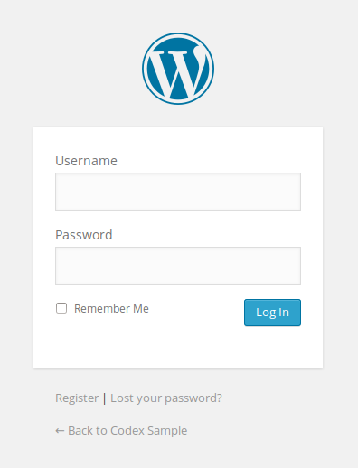
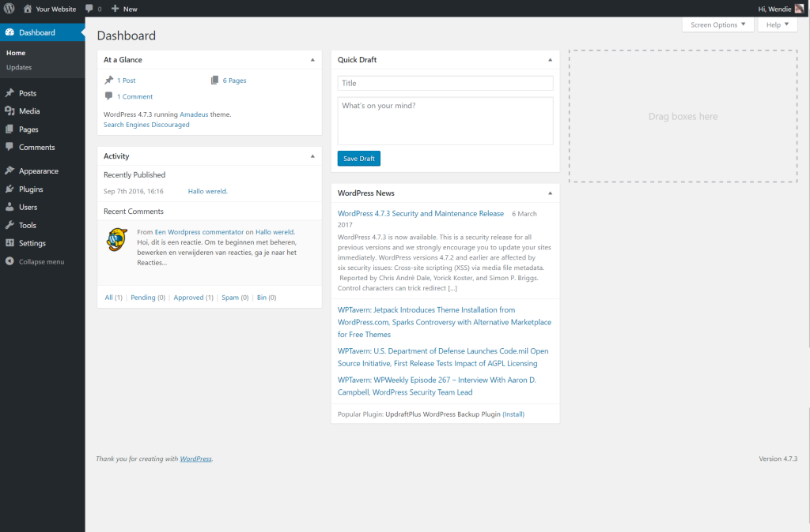
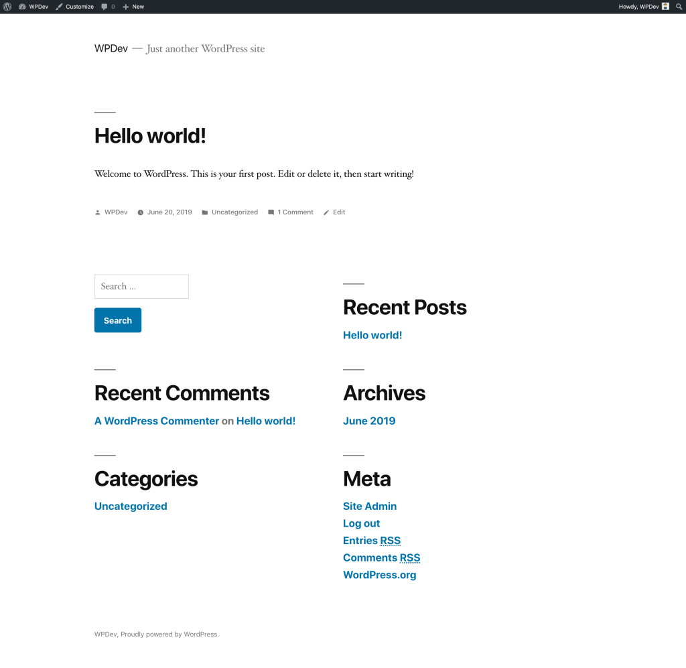
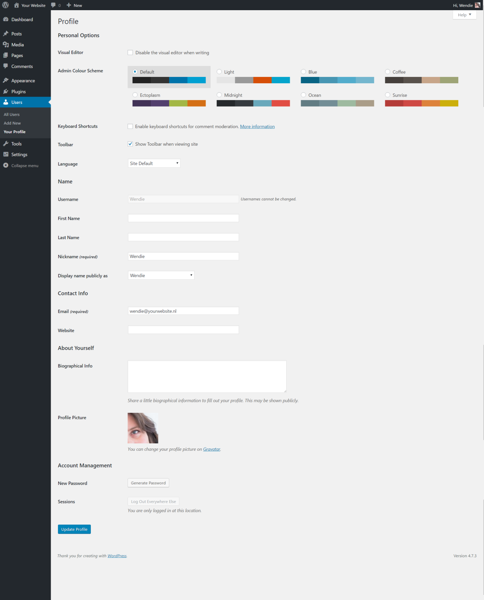
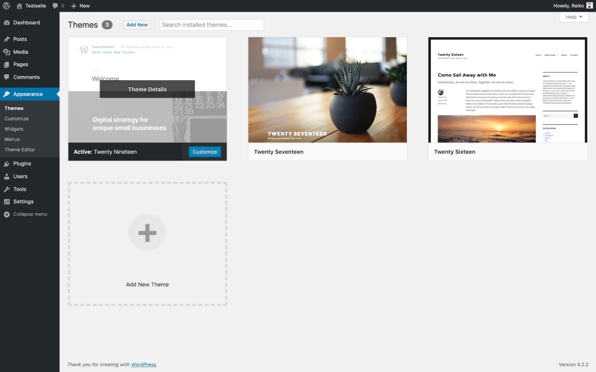
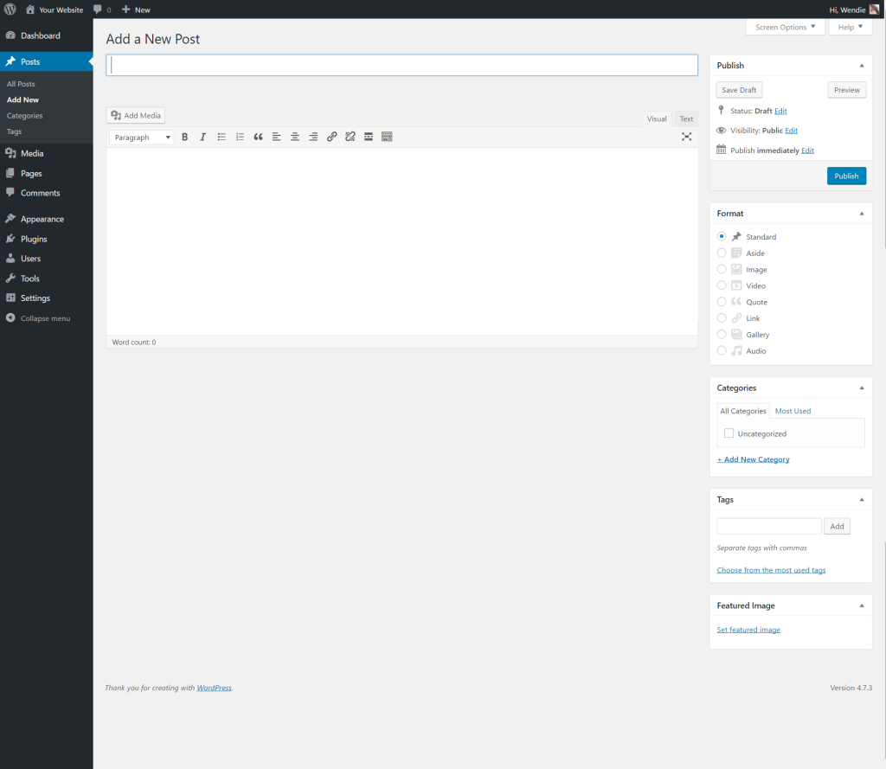
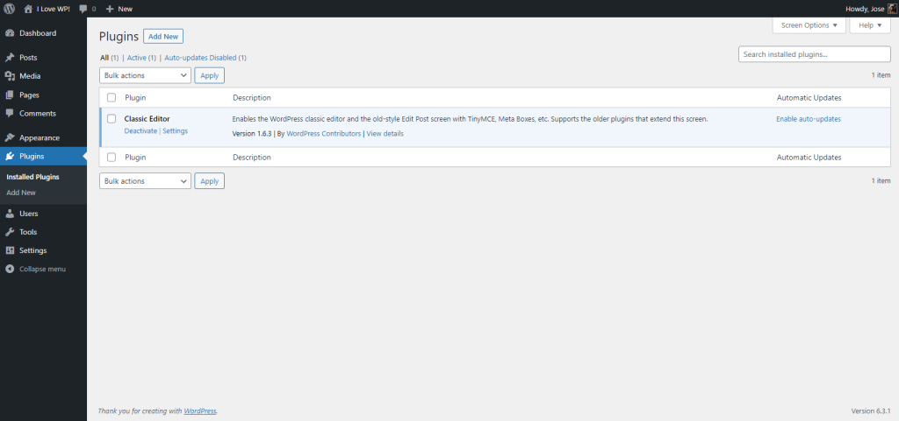

## 🚀 WordPress’e İlk Adımlar (Classic Editor / Klasik Düzenleyici)

Not: Bu sayfa, WordPress’in eski ya da **Classic Editor (Klasik Düzenleyici)** kullanımıyla ilgilidir. Eğer yeni bir WordPress sürümünde ya da **block editor (blok düzenleyici)** kullanıyorsanız, lütfen bu sayfaya bakınız.

---

## ⏱️ 5 Dakikalık Kurulumu Tamamladım. Şimdi Ne Yapmalıyım?

WordPress’in **5-Minute Installation (5 Dakikalık Kurulum)** sürecini ya da hosting sağlayıcınız üzerinden **one-click install (tek tıkla kurulum)** işlemini tamamladınız. Peki sıradaki adım nedir?

Haydi WordPress sitenizi adım adım keşfe çıkalım. Farklı işlevlerin nasıl çalıştığını ve yeni sitenizi nasıl size özel hale getireceğinizi görelim. Bu eğitimin ilk bölümünde, anlatımın parçası olmayan hiçbir şeyi değiştirmemeniz tavsiye edilir. Bu adımları tamamladıktan sonra zaten birçok şeyi değiştirmeye başlayacaksınız.

---

## 🔑 Giriş Yap (Log In)

## 🔑 Yönetim Alanına Giriş Yap (Log In)

Öncelikle sitenizin **administration area (yönetim alanı)** ya da diğer adıyla **back end (arka uç)** kısmına giriş yapın. Bunun için alan adınızın sonuna `wp-admin` ekleyerek giriş sayfasına gidin (örneğin: `http://example.com/wp-admin`). Bazı temalar (themes) ön yüzünde (front end) giriş bağlantısı ya da formu da sunabilir.

Şimdi, **5-Minute Install (5 Dakikalık Kurulum)** sırasında oluşturduğunuz kullanıcı adı ve şifreyle WordPress’e giriş yapın.

---

## ⬆️ En Üstten Başlayın (Start at the Top)

## 🖥️ Yönetim Ekranı: Gösterge Paneli (Dashboard)

Giriş yaptıktan sonra, **Administration Screen (Yönetim Ekranı)** olarak adlandırılan ve **Dashboard (Gösterge Paneli)** diye bilinen ana ekranda olacaksınız. Sitenizin düzenlenmesi burada başlar.

Ekranın en üst kısmında **toolbar (araç çubuğu)** bulunur. Burada sitenizin adına tıklayın; bu bir bağlantıdır ve sizi yeni WordPress sitenizin ön izlemesine götürür. Beğendiniz mi? Beğenmediniz mi? Önemli değil, sadece göz atın. Çünkü burada çok zaman geçireceksiniz!

---

## 🚗 WordPress Sitenizi Test Edin (Test Drive Your WordPress Site)

Değişikliklere başlamadan önce sitenize biraz zaman ayırarak göz atın ve nasıl çalıştığını görün. **WordPress Twenty Nineteen theme (Twenty Nineteen teması)** nasıl düzenlenmiş ve nasıl çalışıyor inceleyin. Bunu, özel özellikler eklemeye başlamadan önce bir **test sürüşü** olarak düşünün.

## 🎨 WordPress Teması ve Düzen (Theme and Layout)

Gördüğünüz düzen bir **WordPress Theme (WordPress Teması)** tarafından belirlenir. Bu, sitenizin görünümünü, stilini ve içeriğin çerçevelenmesini sağlar. **WordPress Twenty Nineteen theme (Twenty Nineteen teması)**, sitenizin başlık ve sloganını içeren bir **header (üst kısım)** ile başlar. Bunun altında bir **Menu (Menü)** bulunur (eğer varsa). Sayfanın yan tarafında bazı başlıklar ve bağlantılar göreceksiniz. Bu kısma **Sidebar (Kenar Çubuğu)** denir. Sidebar içindeki farklı öğelere **Widgets (Bileşenler)** adı verilir. Sayfanın ortasındaki ana bölüm ise \*\*content area (içerik alanı)\*\*dır.

Sayfayı aşağıya kaydırın ve en alt kısımdaki çubuğu fark edin. Buna **footer (altbilgi)** denir. Burada “Proudly powered by WordPress” ifadesi yer alır.

Sidebar’a geri dönersek, burada farklı bilgi bölümleri göreceksiniz. Bunlar arasında **Recent Posts (Son Yazılar)**, **Recent Comments (Son Yorumlar)**, **Archives (Arşivler)**, **Categories (Kategoriler)**, yönetim ekranlarına bağlantılar, **Log Out (Çıkış Yap)** ve **RSS feeds (RSS beslemeleri)** bulunabilir. Bu alan, ziyaretçilerin sitenizde gezinmesi, farklı kategorilerden ya da dönemlerden yazılara ulaşması için kullanılan \*\*menu (menü) / navigation Screen (navigasyon ekranı)\*\*nin bir parçasıdır.

---

## 🗺️ Kısa Bir Tur Atın (Take a Quick Trip Around)

Şimdilik yalnızca bir yazınız var. Bu yazı, sitenizin **home page (ana sayfa / ön sayfa)** olarak düzenlenmiş bir sayfa içinde yer alır. Yazının başlığına tıkladığınızda sizi doğrudan o yazıya ait sayfaya götürür.

Sitenizin ana sayfası en son yazılarınızı gösterir. Her yazı başlığı, o yazının kendi sayfasına yönlendiren bir bağlantıdır. Bazı tema tasarımcıları, tekil yazı sayfalarını ana sayfadan farklı görünecek şekilde tasarlar.

Tek bir yazıya girdiğinizde düzeni inceleyin ve tasarım öğelerindeki farklılıklara dikkat edin. **Header (üst kısım)** farklı mı? Daha küçük, daha büyük ya da farklı bir renkte mi? **Sidebar (kenar çubuğu)** var mı?

Tüm bu değişiklikler, **template files (şablon dosyaları)** adı verilen birkaç dosya sayesinde yapılır. Bunların nasıl çalıştığını öğrenmek için \*\*Theme Developer Handbook (Tema Geliştirici El Kitabı)\*\*na göz atabilirsiniz. Ama şimdilik WordPress’in geri kalan işleyişine devam edelim.

---

## ⚙️ WordPress Yönetim Ekranlarını Test Et (Test Drive the WordPress Administration Screens)

Artık sitenizin nasıl göründüğüne ve farklı düzen bölümlerinin isimlerine dair bir fikriniz olduğuna göre, WordPress Yönetim ekranlarını test etme zamanı. Bu, yeni web sitenizin **backend (arka uç)** kısmıyla tanışmak gibidir.

Aslında giriş yaptıktan sonra gördüğünüz ilk sayfa \*\*Dashboard (Gösterge Paneli)\*\*dir. Bu sayfa, WordPress sitenizdeki etkinlikler ve işlemlerle ilgili bilgi ve verilerin bir koleksiyonudur.

## 📊 Gösterge Paneli (Dashboard)

**Dashboard (Gösterge Paneli)**, sitenizde gerçekleştirdiğiniz en son etkinliklerin bir listesini sunar ve ayrıca WordPress kaynaklarından gelen yeni ve ilgi çekici bilgileri takip etmenize yardımcı olur.

Ekranın sol tarafında, gerçekleştirebileceğiniz tüm \*\*administrative functions (yönetim işlevleri)\*\*ni detaylandıran **main navigation menu (ana gezinme menüsü)** bulunur. Fareyi bu liste üzerinde gezdirdiğinizde, alt menüler (sub-menus) açılır ve tıklayarak ilgili bölümlere geçebilirsiniz. Bir **parent (ana)** menü bölümünü seçtiğinizde, o bölümün seçeneklerini görebilirsiniz.

Menüdeki farklı öğeler şunlardır:

* **Dashboard (Gösterge Paneli)**
* **Posts (Yazılar)**
* **Media (Ortam)**
* **Pages (Sayfalar)**
* **Comments (Yorumlar)**
* **Appearance (Görünüm)**
* **Plugins (Eklentiler)**
* **Users (Kullanıcılar)**
* **Tools (Araçlar)**
* **Settings (Ayarlar)**

---

## 👤 Kullanıcı Ekranı ile Başlayalım (Let’s start with the User screen)

**Users (Kullanıcılar)** sekmesine tıklayın. Ekran değişecek ve tüm kullanıcıların listelendiği **All Users (Tüm Kullanıcılar)** ekranını göreceksiniz. Buradan yeni kullanıcılar ekleyebilir ya da mevcut kullanıcı ve yazar hesaplarını değiştirebilirsiniz.

Gezinme menüsünde **Your Profile (Profiliniz)** seçeneğine tıklayın. Burası, sitenin yazarı ve yöneticisi olan sizin hakkınızda bilgi gireceğiniz alandır. Bilgileri doldurun ve işlem tamamlandığında **Update Profile (Profili Güncelle)** düğmesine tıklayın.

Şimdi WordPress Yönetim ekranının diğer güçlü özelliklerine bakalım.

---

## 🎨 Görünümü Değiştirme (Changing the Look)

## 🎨 Görünüm: Temalar Ekranı (Appearance, Themes Screen)

**Appearance > Themes (Görünüm > Temalar)** ekranı, farklı **Themes (Temalar)** kullanarak sitenizin görünümünü değiştirmenizi sağlar. Temalar, sitenizin görünümünü tamamen değiştiren sunum stilleridir. Geliştiriciler ve kullanıcılar tarafından tasarlanan yüzlerce tema arasından seçim yapabilirsiniz.

**Appearance (Görünüm)** ekranında, şu anda kurulu olan temaların bir listesini göreceksiniz. Bu listeye **WordPress Twenty Nineteen theme (Twenty Nineteen teması)** de dahildir.

Bir temayı hızlıca değiştirmek için listedeki temalardan birinin altındaki **Activate (Etkinleştir)** düğmesine tıklayın, ardından üst araç çubuğundaki site adınıza tıklayarak yeni görünümü inceleyin. İşte bu kadar kolay!

Sonra tekrar **Appearance > Themes (Görünüm > Temalar)** ekranına gidin ve **Twenty Nineteen** temasının altındaki **Activate (Etkinleştir)** düğmesine tıklayarak eski tasarımınıza geri dönün. Site adınıza yeniden tıklayın ve siteniz tekrar eski haliyle karşınızda.

---

## ✍️ Yazı Oluşturma (Creating a Post)

Yönetim ekranına geri dönün ve **Posts (Yazılar)** ekranına göz atın. **Posts Menu (Yazılar Menüsü)** altındaki sekmeleri kullanarak yazılarınızı oluşturabilir ve yönetebilirsiniz.

İlk test yazınızı oluşturmak için **Add New (Yeni Ekle)** sekmesinden başlayalım.

## ✍️ Bir Yazı Oluşturma (Creating a Post)

Yazı başlığını girerek başlayın, ardından yazı penceresine küçük bir test mesajı yazın. Bu sadece bir deneme olduğu için istediğiniz herhangi bir şeyi yazabilirsiniz. İşiniz bittiğinde, yazı giriş penceresinin sağında bulunan **Publish (Yayınla)** düğmesine tıklayın ve işlem tamamdır.

Artık yazı yazma deneyimini biraz hissettiniz. Ekranın üst kısmındaki araç çubuğunda yer alan site adınıza tıklayarak yazınızı görebilirsiniz.

---

## 💬 Yorumlar (Comments)

WordPress’in eğlenceli yanlarından biri de ziyaretçilerin sitenizde **comments (yorumlar)** bırakabilmesidir. Bu, sizinle ziyaretçiler arasında dinamik bir etkileşim yaratır.

Peki yazılarınızda yorum istiyor musunuz? Yorumlar, kısa tebriklerden (“Harika iş! Yazıyı beğendim!”) uzun tartışmalara kadar farklı formlarda olabilir. Belki de yazınıza katkı sağlayacak yorumlar istiyorsunuz.

Yorumlara cevap vermek ve onları denetlemek de zaman alabilir. Eğer siteniz için önemliyse yorumları etkin bırakın ve nasıl görüneceklerine karar verin. Test yazınıza kendiniz birkaç yorum bırakabilir, nasıl göründüklerine göz atabilir ve sitenizin tasarımıyla uyumlu olup olmadığını değerlendirebilirsiniz.

Yorumları nasıl yöneteceğinize karar verdikten sonra, WordPress’in **comments (yorumlar)** ve **discussion options (tartışma ayarları)** hakkındaki makalesini okumanız faydalı olacaktır.

---

## 🛡️ Spam’i Önleme (Preventing Spam)

Sitenizde yorumlara izin verdiğinizde düşünmeniz gereken bir başka konu da **spam**’dir. Ne yazık ki spam hayatın bir gerçeği. Bu nedenle, **Introduction to Dealing with Comment Spam (Yorum Spam’iyle Mücadeleye Giriş)** makalesini okuyarak spam yorumcularla başa çıkmaya başlamanız önerilir.

---

## 🗂️ Kategoriler Oluşturma (Create Categories)

WordPress’te yazılar genellikle **Categories (Kategoriler)** ve/veya **Tags (Etiketler)** altında saklanır. Bu, ilgili konuları bir arada tutmanıza yardımcı olur.

Şu anda yalnızca bir kategoriniz var, ama yakında daha fazlasına ihtiyacınız olacak. Bunun için **Posts > Categories (Yazılar > Kategoriler)** sekmesinden, **Add New Category (Yeni Kategori Ekle)** alanına kategori bilgilerinizi girin. Önce tüm ana kategorilerinizi ekleyin, ardından alt kategorilere geçin.

Not: İstediğiniz zaman yeni bir kategori ekleyebilirsiniz. Ancak şunu unutmayın: WordPress’te kategoriler iki şekilde sıralanabilir — **isim (alfabetik)** veya **ID numarası**. Her kategori eklendiğinde ona bir ID atanır ve bunu değiştirmek zordur. Bu nedenle, kategorilerinizin alfabetik değil de belirli bir sırada görünmesini istiyorsanız, girişleri görmek istediğiniz sıraya göre ekleyin.

---

## ⚙️ Sitenizi Ayarlama (Setting Up Your Site)

Sitenizin görsel görünümüne geçmeden önce biraz daha yönetimsel ayar yapalım.

* Sitenizi güçlendirmek için eklentiler (plugins) yüklemek isteyebilirsiniz.
* Tüm WordPress sitelerinde mevcut olan **Akismet WordPress Plugin**’ini etkinleştirmeyi unutmayın. Bu eklenti, yorum spam’lerinden korunmanıza yardımcı olur.

Ana kategorilerinizi ekledikten sonra alt kategorilerinizi oluşturabilirsiniz. **Parent Category (Ana Kategori)** açılır menüsünden, eklediğiniz alt kategorinin bağlı olacağı ana kategoriyi seçin.

**Manage > Categories (Yönet > Kategoriler)** ekranında kategoriler şu şekilde listelenir:

* Computer Tips

  * Windows
  * Linux
  * Mac
* Internet News
* Web Page Design
* Web Standards
* WordPress

  * Plugins
  * Themes

---

## 🗃️ Yazıları Kategorilere Koyma (Put Posts in Categories)

Şimdi test yazılarınızı kategorilere yerleştirelim. Bunun için **Posts > Categories (Yazılar > Kategoriler)** ekranından **All Posts (Tüm Yazılar)** sekmesine gidin. Burada girdiğiniz test yazılarını göreceksiniz.

Her yazı başlığının üzerine geldiğinizde **Edit | Quick Edit | Trash | View (Düzenle | Hızlı Düzenle | Çöp | Görüntüle)** bağlantılarını göreceksiniz. **Edit (Düzenle)** seçeneğine tıklayın.

**Edit Post (Yazıyı Düzenle)** ekranının sağ tarafında kategoriler bölümünü göreceksiniz. İlgili kutucuğu işaretleyin, ardından üstteki **Update (Güncelle)** düğmesine tıklayın.

Bunu tüm test yazılarınız için tekrarlayın ve her birini farklı bir kategoriye ekleyin.

Sonra, yönetim ekranının üstündeki araç çubuğunda site adınıza tıklayarak sayfanızı görüntüleyin. Artık kenar çubuğunda kategorileri görebiliyor musunuz? Harika. Eksik kategori varsa endişelenmeyin; bu genellikle içinde yazı olmadığı anlamına gelir. O kategoriye yazı eklediğinizde, sayfalarınızda görünecektir.

Bir kategoriye tıklayın, yalnızca o kategoriye ait yazıları listeleyen bir sayfaya yönlendirileceksiniz. Bu, WordPress tarafından oluşturulan \*\*Category Page (Kategori Sayfası)\*\*dir.

Şimdi ayın gösterildiği **Archives (Arşivler)** bağlantısına tıklayın. Böylece yazılarınızı kronolojik olarak listeleyen bir sayfayı ziyaret etmiş olursunuz — aslında sadece bugünkü yazılarınızı. Aynı bilgiyi bulmanın iki farklı yolu.

---

## ⏭️ Sırada Ne Var (What Is Next)

Artık yeni WordPress siteniz için temel işlemleri öğrendiniz:

* Yazı yazmak
* Kategori oluşturmak
* Kategori ve arşive göre site içeriğini görüntülemek

Şimdi özelleştirme sürecine başlayabilirsiniz. İşiniz bittiğinde test yazılarınızı silmeyi unutmayın. Artık yeni kitlenizle paylaşmak için harika içerikler yazmaya hazırsınız!

---

## 🎨 WordPress Temaları Kullanma (Using WordPress Themes)

Seçebileceğiniz yüzlerce **WordPress Theme (WordPress Teması)** vardır. Hepsi temelde aynı işlevi görür, fakat bilgiyi farklı grafiksel biçimlerde sunar.

* İlginizi çeken ve hedef kitlenizin ihtiyaçlarını karşılayan birkaç tema seçin.
* Yukarıda anlatıldığı gibi bir “test sürüşü” yaparak temaları deneyin.
* Ana sayfa, kategoriler, arşivler ve tekil yazılar üzerinde nasıl göründüklerini inceleyin.

Ön sayfadaki görünümü hoşunuza gidebilir, ancak tekil yazılarda istemediğiniz bir düzenle karşılaşabilirsiniz. Bu durumda kodlara müdahale ederek değişiklik yapmanız gerekir. Hazır değilseniz başka bir temayı deneyin.

---

## 📂 WordPress Tema Kaynakları (WordPress Theme Resources)

* **WordPress Theme Directory (WordPress Tema Dizini)**
* **Using Theme (Tema Kullanımı)**
* **Creating your own Theme (Kendi Temanızı Oluşturma)**

Eğer **CSS**, **HTML** ve hatta **PHP** ile **MySQL** bilgisine sahipseniz, temanızı kendi ihtiyaçlarınıza göre özelleştirmeyi ya da tamamen kendi temanızı geliştirmeyi düşünebilirsiniz.

Daha fazlası için: **WordPress Theme Developer Handbook (WordPress Tema Geliştirici El Kitabı)**

---

## 🔌 WordPress Eklentilerini Kullanma (Using WordPress Plugins)

## 🔌 WordPress Eklentileri (WordPress Plugins)

**WordPress Plugins (WordPress Eklentileri)**, başka bir deyişle **add-ons (eklentiler)** veya **extensions (uzantılar)** olarak da bilinir. Bunlar, sitenize yeni işlevler ve özellikler ekleyen yazılım betikleridir. Güncel hava durumu raporlarından, yazılarınızın ve kategorilerinizin basit düzenlenmesine kadar geniş bir yelpazeyi kapsar.

Eklentiler, gönüllü katkıcılar ve problem çözmeyi seven meraklılar tarafından geliştirilir. Kurulumları genellikle oldukça basittir; **WordPress Admin Plugin Screen (Yönetim Eklentileri Ekranı)** üzerinden yapılır. Tek yapmanız gereken, eklenti yazarının sağladığı yönergeleri izlemektir.

Unutmayın, bunlar ücretsizdir ve zorunlu değildir. Eklentilerle ilgili bir sorun yaşarsanız:

1. Öncelikle eklenti yazarının web sitesine veya eklenti kaynağına bakın.
2. Ardından internet üzerinde o eklentiyle ilgili çözüm arayın.
3. Hâlâ çözüm bulamazsanız **WordPress forumları**na giderek yardım isteyin.

---

## 📂 WordPress Plugin Directory (WordPress Eklenti Dizini)

* **Managing Plugins (Eklentileri Yönetme)**
* **Creating your own Plugin (Kendi Eklentinizi Oluşturma)**

Eğer **PHP**, **HTML** ve hatta **MySQL** biliyorsanız, WordPress’i kendi ihtiyaçlarınıza göre özelleştirmek için kendi eklentinizi geliştirebilirsiniz.

Daha fazlası için: **WordPress Plugin Developer Handbook (WordPress Eklenti Geliştirici El Kitabı)**

---

## 🚀 Temel Bilgilerin Ötesine Geçmek (Above and Beyond the Basics)

WordPress’in heyecan verici yanı, sınırlarının neredeyse olmamasıdır. Binlerce insan WordPress’i blog yazmak veya web sitelerini yönetmek için kullanıyor.

Örneğin, **WordPress.org Theme Showcase (Tema Vitrini)** bölümündeki bazı örneklere bakabilirsiniz. Hepsinin farklı görünümleri ve işlevleri vardır.

Bundan sonrası tamamen size bağlı. Ancak temellerin ötesine geçmek için başlayabileceğiniz birkaç bölüm şunlardır:

* **WordPress Features (WordPress Özellikleri)**
* **Working with WordPress (WordPress ile Çalışmak)**
* **WordPress Semantics (WordPress Semantiği)**
* **Using Pages (Sayfaları Kullanma)**
* **Troubleshooting (Sorun Giderme)**
* **Using Permalinks (Kalıcı Bağlantıları Kullanma)**
* **Getting More Help (Daha Fazla Yardım Alma)**
* **Using the Support Forums (Destek Forumlarını Kullanma)**

---

## 📢 Geri Bildirim (Feedback)

Bu makale yardımcı oldu mu? Nasıl geliştirilebilirdi?

Bize gönderdiğiniz geri bildirimler yalnızca belgeleri sürdüren ekibe gider. Sorularınız olursa ya da ek geri bildirime ihtiyaç duyarlarsa sizinle iletişime geçebilirler. Ancak bu, perde arkasında kalır.

Bu, kişisel destek için değildir. Yardım almak için lütfen bir **forum başlığı** oluşturun ve topluluktan destek alın.
