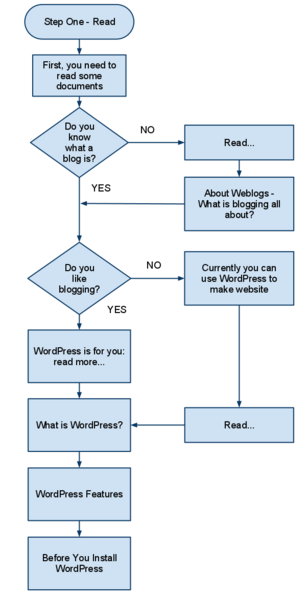

## 🚀 WordPress ile Başlarken (Get started with WordPress)

Eğer WordPress’e yeniyseniz, başlamanız için adım adım bir plan burada yer almaktadır. Yol boyunca yardıma ihtiyacınız olursa, bu makalede birçok destek seçeneği listelenmiştir. WordPress’in heyecan verici dünyasına hoş geldiniz!

## 📖 Birinci Adım – Okuyun (Step one – Read)

WordPress harika bir üründür. Kullanımı kolay, güçlü ve esnektir. Bir web sitesi oluşturmak ve bir web sitesini yönetmek, hızla gelişen bir bilim ve sanattır. Bunu tam olarak kavrayabilmek için konu hakkında iyi bilgi sahibi olmak önemlidir. Akılda tutulması gereken en önemli şeylerden biri zaman yatırımınızdır. Bilgili olmak, uzun vadede size kesinlikle çok zaman kazandıracaktır. Bunu göz önünde bulundurarak, WordPress’i kurmaya değerli zamanınızı ve enerjinizi harcamadan önce başlamanıza yardımcı olacak bazı belgeleri okumanız gerekir.

## 📚 Önerilen Okumalar (Suggested reading includes)

* Bloglamaya Giriş (Introduction to Blogging)
* WordPress Özellikleri (WordPress Features)
* WordPress’i Kurmadan Önce (Before You Install WordPress)

---

## 📝 İkinci Adım – Bir plan yapın (Step two – Make a plan)

Az önce okuduğunuz bilgiler, WordPress kurulum talimatları da dahil olmak üzere, ihtiyaç duyduğunuz şeylerin ve yapılacakların bir listesini oluşturmanıza yardımcı olacaktır. Eğer henüz böyle bir listeniz yoksa, şimdi oluşturun. Listenizin aşağıdaki bilgileri içerdiğinden emin olun:

* Çevre gereksinimleri (Environment requirements)
* Web sitenizin kullanıcı adı ve parolası (Your Website Username and Password)
* Metin düzenleyici yazılımı (Text Editor Software)
* Bir FTP istemci yazılımı (An FTP Client Software)
* Tercih ettiğiniz web tarayıcısı (Your Web Browser of Choice)

Aşağıdaki belgeler, WordPress’in nasıl çalıştığını ve siteniz için bir plan yapmayı daha iyi anlamanıza yardımcı olacaktır:

* WordPress terimleri (WordPress terminology)
* WordPress ile İlk Adımlar (First Steps With WordPress)
* WordPress Dersleri (WordPress Lessons)

WordPress’i sitenizde nasıl kullanmak istediğiniz konusunda bir plan yapmak önemlidir. Kendinize şu soruları sorun:

* WordPress’i kök dizine mi, alt dizine mi kuracaksınız, yoksa sadece deneme amaçlı bir site mi oluşturmak istiyorsunuz?
* İçeriğinizi gruplar halinde düzenlemek için site kategorilerinizin bir listesini yaptınız mı?
* Hakkında, İletişim veya Etkinlikler gibi sitenize eklemek istediğiniz sayfaların bir listesini çıkardınız mı?
* Sitenin üstbilgi (header) kısmına ne koymak istediğinizi düşündünüz mü?
* Bloglamaya başlamak için bir içerik stratejisi ve konu listesi geliştirdiniz mi?
* Sosyal medyayı WordPress sitenize ve iş akışınıza nasıl entegre edeceğinizi düşündünüz mü?

---

## ⚙️ Üçüncü Adım – WordPress’i kurun (Step three – Install WordPress)

Bu bilgiler ve planınızla artık WordPress’i kurma zamanı.

* WordPress’i Kurmadan Önce (Before You Install WordPress)
* WordPress’i Kurmak (Installing WordPress)
* `wp-config.php` dosyasını düzenlemek (Editing the wp-config.php file)
* WordPress Kurulumu Hakkında SSS (Frequently Asked Questions About Installing WordPress)
* FTP İstemcileri ve Yazılımı Kullanmak (Using FTP Clients and Software)
* Dosya İzinlerini Değiştirmek (Changing File Permissions)
* WordPress’i Güncellemek (Updating WordPress)
* Yaygın Kurulum Sorunları (Common Installation Problems)
* Sorun: Giriş Yapamıyorum (Trouble: I Can’t Login)

---

## 🔧 Dördüncü Adım – WordPress’i ayarlayın (Step four – Set up WordPress)

Kurulum tamamlandığında, WordPress’i istediğiniz gibi çalışacak şekilde ayarlama zamanı gelmiştir.

WordPress Yönetim Ekranlarındaki (Administration Screens) tüm özellikleri ve ekranları anlamanıza yardımcı olmak için Yönetim Ekranları Kılavuzu’nu inceleyin.

Kullanıcı profil bilgilerinizi oluşturmak için (bunların bir kısmı veya tamamı temanıza yansıyabilir), `Kullanıcılar > Profiliniz (Users > Your Profile)` sayfasını inceleyin.

Site adını ve diğer bilgileri ayarlamak için panodaki `Yönetim > Ayarlar > Genel (Administration > Settings > General)` bölümüne gidin.

Birkaç yazı yayımladıktan sonra, `Yönetim > Yazılar > Yazılar (Administration > Posts > Posts)` ekranında tam düzenleme veya hızlı düzenleme özelliklerini deneyebilirsiniz.

“Hakkında”, “İletişim” ve diğer bilgi sayfalarını eklemek için `Yönetim > Sayfalar > Yeni Ekle (Administration > Pages > Add New)` bölümünü kullanın.

WordPress sitenizin görünümünü değiştirmek mi istiyorsunuz? `Yönetim > Görünüm > Temalar (Administration > Appearance > Themes)` bölümüne gidin.

Ayrıca, WordPress Dersleri’ni (WordPress Lessons) okuyabilir ve şu yararlı belgelere göz atabilirsiniz:

* WordPress.com ve kendi barındırdığınız WordPress için başlangıç dersleri
* Yorumları yönetmek (Moderating Comments)
* Yorum spam’iyle başa çıkmaya giriş (Introduction to Dealing with Comment Spam)

---

## 🎨 Görünüm ve Temalar (Appearance and themes)

WordPress web sitenizin görünümünü yalnızca birkaç tıklama ile değiştirmek kolaydır.

* WordPress Temalarını Kullanma Giriş (Using WordPress Themes Introduction)
* WordPress Tema Dizini (WordPress Theme Directory) binlerce tema içerir
* WordPress Bileşenleri (WordPress Widgets), temanıza hızlıca bilgi ve içerik eklemenizi sağlar

Kendi temanızı sıfırdan oluşturmak, büyük yenilikler yapmak veya hatta halka açık WordPress Temaları tasarlamak istiyorsanız, WordPress Tema Geliştirici El Kitabı’nı (WordPress Theme Developer Handbook) ziyaret etmelisiniz.

Size özel bir WordPress Teması hazırlanmasını istiyorsanız, internette uzman web tasarımcıları aramanız veya yerel topluluğunuzdan destek almanız tavsiye edilir.

---

## 🔌 WordPress Eklentileri Ekleme (Adding WordPress plugins)

WordPress için “eklenti (plugin)” adı verilen birçok ek betik ve program vardır. Bunlar sitenize daha fazla işlev, seçenek ve özellik ekler. WordPress eklentileri pek çok şey yapabilir:

* Site bilgilerinizi özelleştirmek
* Hava durumu raporları eklemek
* Yazım denetimi eklemek
* Özel yazı listeleri ve kısaltmalar sunmak

Daha fazla bilgi için:

* WordPress Eklentilerinizi Yönetmek (Managing your WordPress Plugins)
* WordPress Eklentileri (WordPress Plugins)
* WordPress Eklenti Dizini (WordPress Plugin Directory)

Tıpkı temalarda olduğu gibi, kendi eklentinizi sıfırdan oluşturabilir veya mevcut olanlarda büyük değişiklikler yapabilirsiniz. Ayrıntılar için WordPress Eklenti Geliştirici El Kitabı’nı (WordPress Plugin Developer Handbook) ziyaret edin.

---

## 🚀 WordPress’in Gelişmiş Kullanımı (Advanced use of WordPress)

Artık WordPress’in temel özellikleri ve işlevlerine aşina olduğunuza göre, WordPress’in gücünü daha derinlemesine keşfetmenin zamanı gelmiş olabilir:

* WordPress Geliştirici Kaynakları (WordPress Developer Resources)
* Eğitimler (Tutorials)
* Kalıcı Bağlantıları Kullanmak (Using Permalinks)

---

## 🆘 Daha Fazla Yardım Gerekli mi? (Need more help?)

WordPress kullanımı basit ve kolay olsa da, sorunlar çıkarsa, kafanız karışırsa veya bir şeyler çalışmazsa endişelenmeyin çünkü yardım mevcuttur! WordPress ücretsiz ve açık kaynak olsa da, size yardım etmeye hazır yüzlerce gönüllü vardır. İşte bazı resmi kaynaklar:

* Destek Forumları (Support Forums)

---

## 🤝 WordPress’e Katkıda Bulunmak (Giving back to WordPress)

Artık tam anlamıyla bir WordPress kullanıcısı olduğunuza göre, WordPress’in sürmesini sağlayan belgeler, destek forumu, geliştirme ve diğer gönüllü çalışmalara katkıda bulunmayı düşünün. WordPress tamamen ücretsizdir ve tamamen gönüllüler tarafından desteklenmektedir; yardımınıza ihtiyaç vardır.

* Destek Forumlarını Kullanmak (Using the Support Forums)
* WordPress Forum
* Ders Planları (Lesson plans)
* SSS (FAQ)

---

## 📢 Geri Bildirim (Feedback)

Bu makale faydalı oldu mu? Nasıl geliştirilebilir?

Bize gönderdiğiniz geri bildirim yalnızca belgeleri hazırlayanlara ulaşacaktır. Sorular veya takip amaçlı durumlarda size ulaşabilirler, ancak bu da yalnızca perde arkasında kalacaktır.

Bu kişiselleştirilmiş destek için değildir. Yardım almak için lütfen topluluk desteğinden yararlanmak üzere bir forum başlığı oluşturun.
