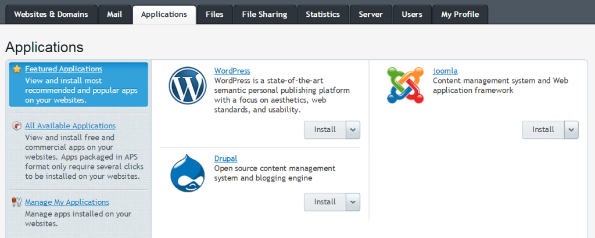
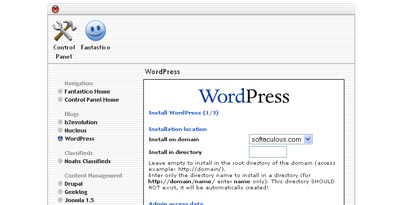
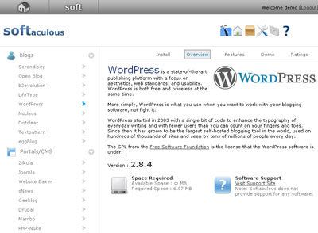

# Use automated installation

## ⚡ Otomatik kurulumu kullanma (use automated installation)

WordPress kurulumu çok kolay olsa da, barındırma (hosting) şirketlerinin sunduğu tek tıkla otomatik yükleyicileri (one-click auto-installers) kullanabilirsiniz. En popüler otomatik yükleyiciler **APS, Fantastico, Installatron** ve **Softaculous**’tur.

---

## 🖥️ APS (Plesk)

Plesk kontrol panelini kullanıyorsanız iki seçeneğiniz vardır:

- **Tek tıkla hızlı kurulum (one-click quick install)**
- **Özel kurulum (custom install)** → kurulum yolu (installation path) veya veritabanı öneki (database prefix) gibi ayarları yapılandırmanıza izin verir.

Bu seçenekler, WordPress Toolkit etkin olsa da olmasa da kullanılabilir. Ancak, yalnızca WordPress Toolkit etkinleştirildiğinde kurulum sırasında özel güvenlik önlemleri uygulanır. WordPress Toolkit’iniz yoksa, WordPress kurulumlarınız manuel WordPress yüklemeleriyle aynı güvenliğe sahip olur.

### 📌 Kurulum adımları:

1. Plesk hesabınıza giriş yapın ve **Applications** sekmesine gidin. Öne çıkan uygulamalar (Featured Applications) ekranı açılacaktır.
2. Tek tıkla hızlı kurulum için WordPress’in yanında bulunan **Install** düğmesine tıklayın.
   Özel kurulum yapmak istiyorsanız, **Install** düğmesinin yanındaki açılır oka tıklayın ve **Custom** seçeneğini seçin.
3. Hızlı kurulum seçtiyseniz başka bir şey yapmanıza gerek yoktur; WordPress blogunuz zaten kurulmuştur.
   Özel kurulum seçtiyseniz, istediğiniz ayarları değiştirin ve **Install** düğmesine tıklayın.

## 🌟 Fantastico

1. cPanel hesabınıza giriş yapın ve **Fantastico** (veya **Fantastico Deluxe**) seçeneğine tıklayın.
2. Fantastico’ya girdikten sonra, sol tarafta **Blogs** kategorisi altında **WordPress** seçeneğini göreceksiniz. Ona tıklayın.
3. **WordPress Overview** bölümünde **New Installation** bağlantısına tıklayın.
4. Gerekli alanları doldurun ve **Submit** düğmesine tıklayın.
5. İşte bu kadar, kurulum tamamlandı!

## 🏠 Fantastico Ana Sayfası (fantastico home page)

---

## ⚙️ Installatron

**Installatron**, WordPress ve diğer popüler web uygulamalarını anında yüklemeyi ve zahmetsizce yönetmeyi sağlayan tek tıkla web uygulama yükleyicisidir. Installatron ile yönetilen WordPress kurulumları:

* Manuel veya otomatik olarak güncellenebilir,
* Klonlanabilir,
* Yedeklenip geri yüklenebilir,
* Kurulum parametrelerini değiştirmek için düzenlenebilir ve daha fazlası yapılabilir.

Birçok web barındırma sağlayıcısı, kontrol panellerinde Installatron’u sunar. Sağlayıcınızda mevcut değilse, Installatron’u doğrudan **Installatron.com** üzerinden kullanabilirsiniz.

### 📌 Barındırma sağlayıcınızın kontrol paneli üzerinden WordPress kurulumu:

1. Web barındırma kontrol panelinize giriş yapın, **Installatron**’a gidin, **WordPress**’e tıklayın ve **Install this application** seçeneğini seçin.
2. Kurulum ayarlarını özelleştirin (örneğin, WordPress için farklı bir dil seçebilirsiniz).
3. **Install** düğmesine tıklayın. Yönlendirileceğiniz ilerleme sayfasında, WordPress’in birkaç saniye içinde sitenize kurulduğunu görebilirsiniz.

### 📌 Installatron.com üzerinden WordPress kurulumu:

1. **Installatron WordPress** sayfasına gidin ve **Install this application** seçeneğini seçin.
2. Barındırma hesabınızın FTP veya SSH bilgilerini, ardından oluşturduğunuz bir MySQL/MariaDB veritabanı bilgilerini girin. Güvenlik için ayrı bir FTP hesabı ve veritabanı oluşturmanız önerilir.
3. Kurulum ayarlarını özelleştirin (örneğin, WordPress için farklı bir dil seçebilirsiniz).
4. **Install** düğmesine tıklayın. Yönlendirileceğiniz ilerleme sayfasında, WordPress’in birkaç saniye içinde sitenize kurulduğunu görebilirsiniz.

---

## 🏠 Installatron Ana Sayfası (installatron home page)

---

## 🌀 Softaculous

1. Hosting hesabınıza giriş yapın ve **Software/Services** bölümünü bulun.
2. Softaculous içinde bir **Blogs** kategorisi vardır. Bu kategoriyi açın, **WordPress** seçeneğini göreceksiniz. Ona tıklayın.
3. **Install** sekmesini göreceksiniz. Ona tıklayın.
4. Gerekli alanları doldurun ve gönderin.
5. İşte bu kadar, kurulum tamamlandı!

